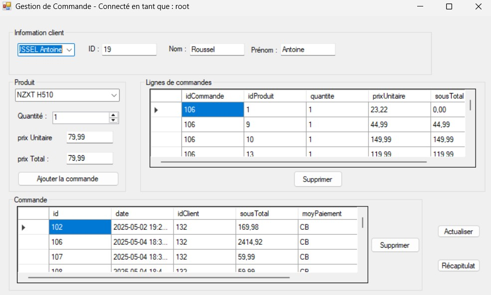
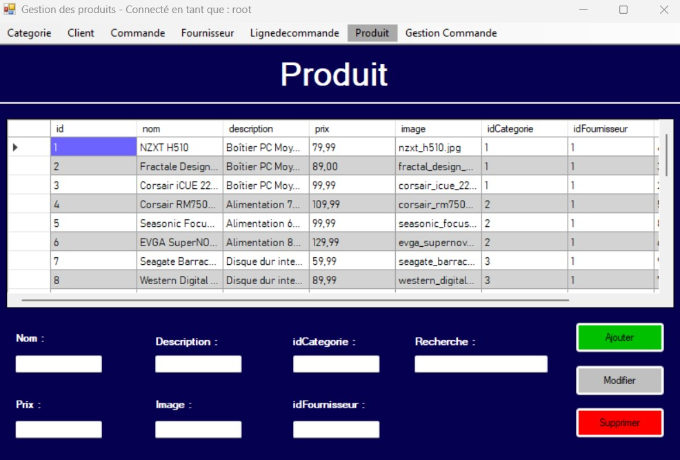
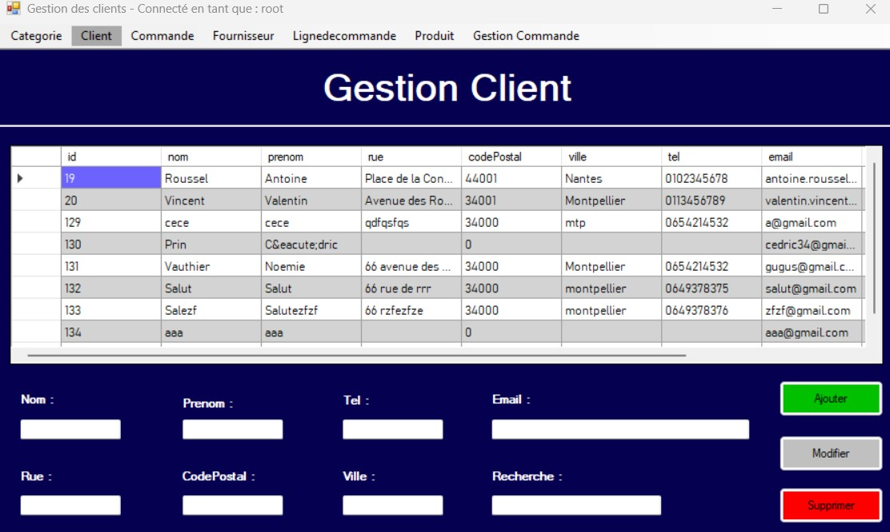
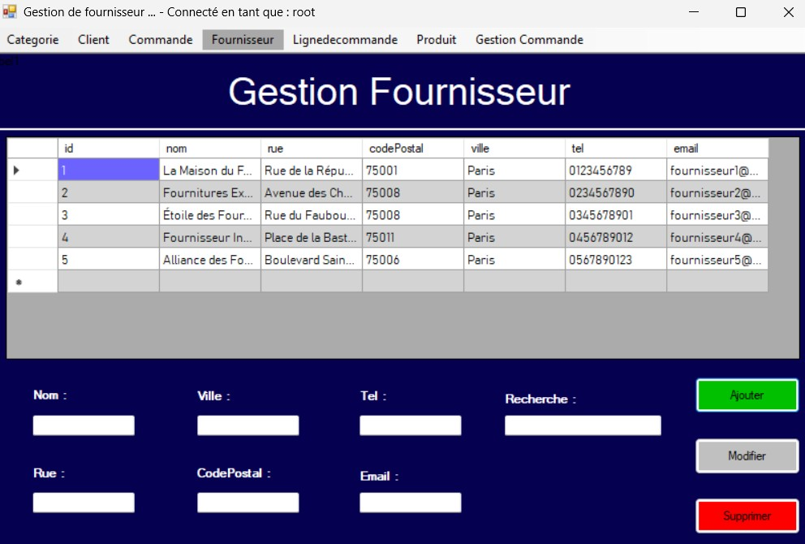
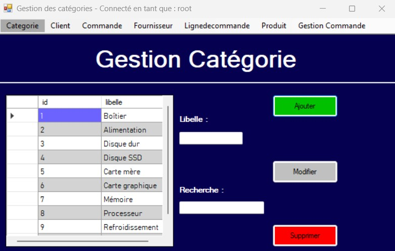
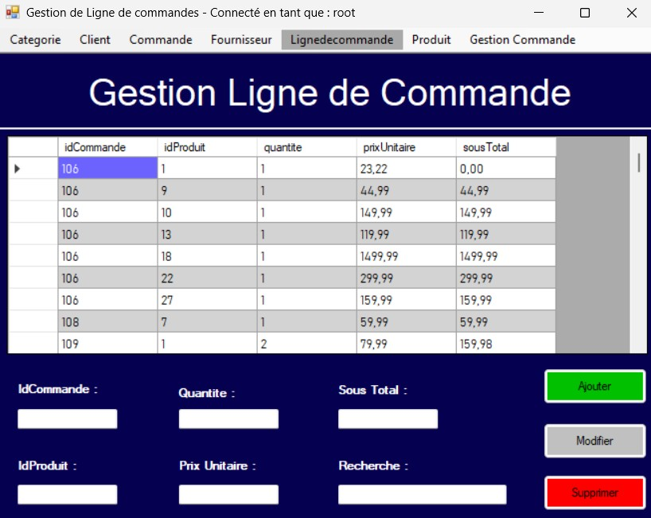
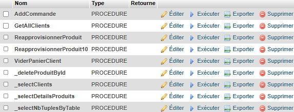
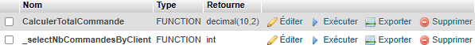
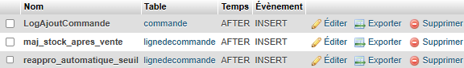

# 🛒 Application de Gestion de Commandes  

**C# / WinForms / MySQL – Projet CRUD complet avec procédures, fonctions et triggers**

Une application de gestion commerciale permettant d'administrer les **clients**, **produits**, **commandes**, **lignes de commande**, **fournisseurs** et la mise à jour du stock en temps réel grâce à des **triggers MySQL**.

Développée en C# WinForms avec une architecture claire, ce projet simule une petite application de gestion utilisée en entreprise.

---

## ✨ Fonctionnalités principales

### 👤 Gestion des clients

- Ajout, modification et suppression de clients  

- Sélection et affichage instantané des informations  

- Chargement automatique des informations liées

### 🛍️ Gestion des produits

- CRUD complet produit  

- Stock mis à jour automatiquement  

- Affichage dynamique du prix unitaire et total  

### 📦 Gestion des commandes

- Création d'une commande liée à un client  

- Gestion des lignes de commande  

- Calcul automatique du total via une fonction SQL  

- Supprimer, actualiser, récapitulatif  

### 🏬 Gestion des fournisseurs

- Ajout / modification / suppression  

- Attribution des produits aux fournisseurs  

### 📊 Base de données avancée

- **Triggers** pour mise à jour automatique du stock  

- **Procédures stockées** pour simplifier les opérations  

- **Fonctions SQL** pour calcul du total d'une commande  

- Sécurisation des opérations via transactions internes

---

## 🖼️ Aperçus de l'application

### Interface principale – Gestion des commandes

### Gestion des produits

### Gestion des clients

### Gestion des fournisseurs

### Gestion des catégories

### Gestion des lignes de commande

---

## 🗄️ Base de données

L'ensemble des éléments SQL est documenté dans `docs/database`.

### 📁 Tables

### ⚙️ Procédures stockées

### 🧮 Fonctions SQL

### 🔄 Triggers MySQL

---

## ⚙️ Technologies utilisées

- **C# WinForms**  

- **MySQL**  

- **POO (Programmation Orientée Objet)**  

- **Xampp / WAMP**  

- **Procédures stockées**  

- **Triggers MySQL**  

- **Fonctions SQL**  

- **ADO.NET**

---

## 📁 Structure du projet

/docs

/assets

gestion_commande.jpg

gestion_client.jpg

gestion_produit.jpg

gestion_categorie.jpg

gestion_fournisseur.jpg

gestion_LigneDeCommande.jpg

/database

tables.png

procedures.png

fonctions.png

triggers.png

/src

(Code source C# WinForms)

---

## 🚀 Compétences démontrées

- Développement d'une application complète en WinForms  

- Maîtrise de la POO en C#  

- Connexion à MySQL via ADO.NET  

- Création et utilisation :

  - de **procédures**

  - de **fonctions SQL**

  - de **triggers avancés**

- Gestion d'une base de données relationnelle complète  

- Architecture propre et structurée  

- Gestion du CRUD global sur plusieurs entités  

- Automatisation des tâches via SQL

---

## 📄 Licence

Ce projet est sous **licence propriétaire**.  

Tous droits réservés.

**Copyright © 2024 Cédric Prin**

Toute reproduction, distribution ou modification sont interdites sans autorisation.

Pour toute demande d'utilisation :  

📧 **prin.cedric.34@gmail.com**

---

## 📬 Auteur

👨‍💻 **Cédric Prin**  

Développeur IA & Fullstack (POEI) – Futur DevOps & CDA Bac+3  

🔗 Portfolio : *bientôt public*  

🔗 LinkedIn : https://www.linkedin.com/in/cedric-prin-dev/

---
